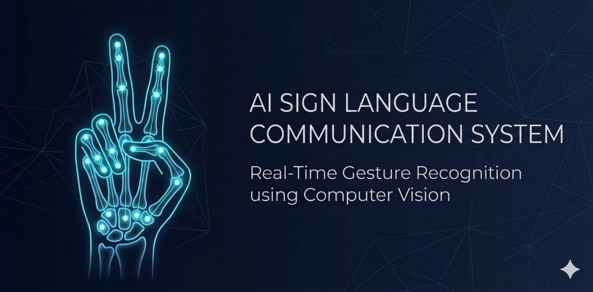
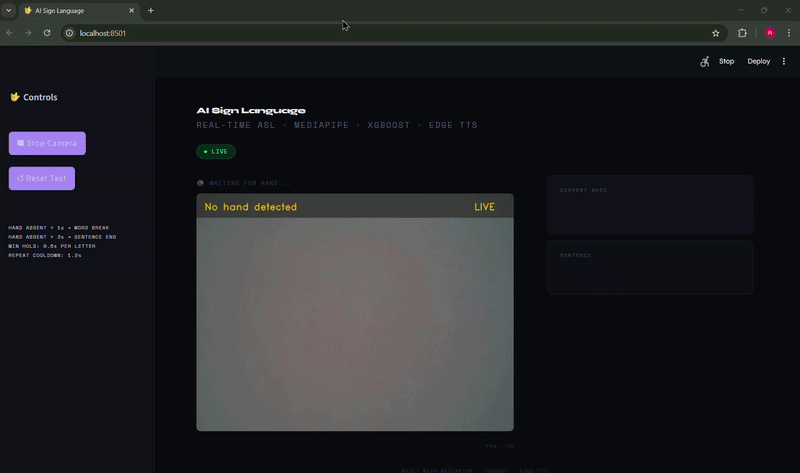
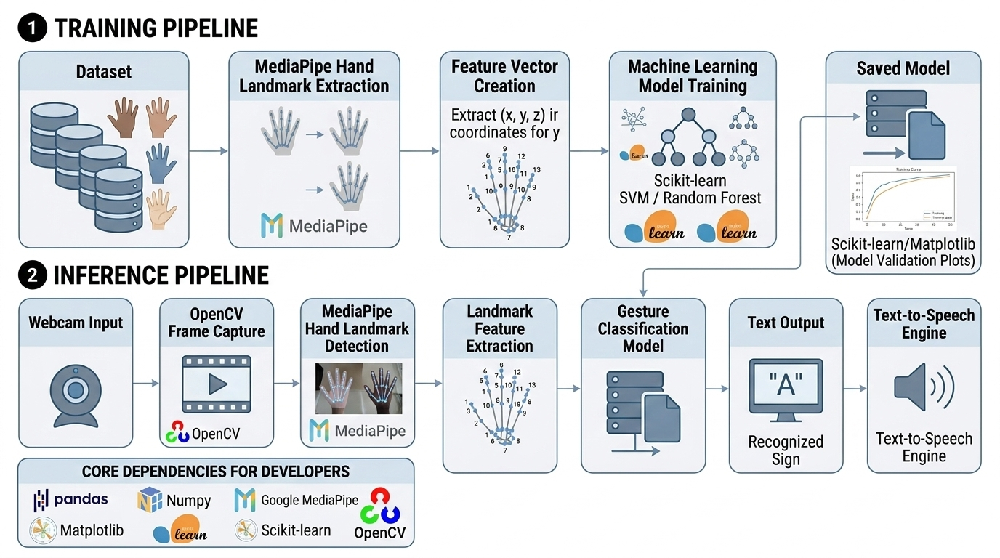

# 🚀 Real-Time Sign Language → Text Communication System


**Translates live ASL hand gestures into stable, real-time text and speech — entirely on-device, with no cloud dependency.**

<br>



---

## Overview

The **AI Sign Language Communication System** is a complete, real-time pipeline that converts American Sign Language (ASL) hand gestures captured via webcam into text and synthesized speech. This is not a gesture demo or a classifier experiment — it is an end-to-end communication system engineered for stability, low latency, and practical use.

The pipeline uses MediaPipe Hands for 21-point 3D landmark extraction, constructs a 134-dimensional normalized feature vector per frame, runs XGBoost inference, and routes predictions through a multi-stage stabilization layer before assembling confirmed characters into words and sentences — which are then spoken aloud via Edge TTS. Everything runs locally at ~30 FPS on standard laptop hardware.

---

## Why This Matters

Over 430 million people worldwide live with disabling hearing loss. For many, sign language is their primary mode of communication — yet most digital systems have no native support for it.

This project addresses that gap directly: a lightweight, fully local system that translates sign language into text and speech in real time, with no internet connection, no specialized hardware, and no cloud subscription required.

---

## Demo



> Real-time ASL recognition at ~30 FPS. Confirmed characters are assembled into words and sentences, then spoken aloud via Edge TTS.

---

## How It Works

```
1. Webcam Input          →   Raw RGB video frames captured via OpenCV
2. Landmark Extraction   →   MediaPipe Hands detects 21 3D keypoints per hand
3. Feature Engineering   →   Keypoints normalized into a 134-dimensional feature vector
4. XGBoost Inference     →   Trained classifier maps feature vector to ASL letter
5. Stabilization         →   Buffer + majority voting + hysteresis confirm predictions
6. Word & Sentence Layer →   Confirmed characters assembled into words and sentences
7. Speech Output         →   Completed sentence spoken aloud via Edge TTS
```

---

## System Architecture



The system is built around four decoupled stages, each with a single responsibility and a clean interface to the next:

| Stage | Module | Responsibility |
|---|---|---|
| Vision | `vision/` | Landmark extraction and feature engineering |
| Inference | `inference/` | XGBoost classification and stabilization |
| Language | `inference/` | Character → word → sentence assembly |
| Output | `app.py` | Text rendering and Edge TTS speech synthesis |

This separation means the classifier, stabilization logic, and output layer can each be modified or replaced without affecting the rest of the system.

---

## Pipeline

```
Webcam
  │
  ▼
MediaPipe Hands ──► 21 3D landmarks per hand
  │
  ▼
Feature Engineering ──► 134-dimensional normalized feature vector
  │
  ▼
XGBoost Classifier ──► Raw per-frame gesture prediction
  │
  ▼
Stabilization Layer ──► Buffer  +  Majority Vote  +  Hysteresis
  │
  ▼
Language Layer ──► Letters → Words → Sentences
  │
  ▼
Output ──► Text display  +  Edge TTS speech synthesis
```

---

## Key Engineering Challenge: Prediction Stability

### The Problem

A real-time classifier running at 30 FPS produces a new prediction every frame. Even a well-trained model generates noisy label switches — minor hand tremor, transitional frames between gestures, or lighting variation can cause rapid flickering between predicted characters. Raw frame-level predictions are not usable as text output.

### The Solution

A three-layer stabilization system sits between the classifier and the output layer:

| Layer | Mechanism | Effect |
|---|---|---|
| **Prediction Buffer** | Stores the last *N* frame predictions in a rolling window | Absorbs transient noise without introducing noticeable lag |
| **Majority Voting** | Commits a label only when it holds a supermajority in the buffer | Blocks false positives from brief or partial mis-predictions |
| **Hysteresis** | Requires a sustained shift in the buffer before switching the active label | Eliminates rapid oscillation at gesture boundaries |

The stabilization layer fully decouples model output from user-facing text. The classifier can fluctuate internally — the displayed output will not. This makes the system genuinely usable rather than just technically functional.

---

## Features

- **Real-time ASL alphabet recognition** — Full A–Z gesture set at ~30 FPS
- **Stable, flicker-free predictions** — Three-layer stabilization (buffer + majority voting + hysteresis)
- **Sentence formation** — Confirmed characters assembled into words and complete sentences
- **Text-to-speech output** — Sentences spoken aloud via Microsoft Edge TTS
- **Lightweight inference** — XGBoost over a 134-dimensional feature vector; no GPU required
- **Fully local** — Zero cloud dependency; runs entirely on-device
- **Modular architecture** — Vision, ML, and inference layers independently replaceable

---

## Tech Stack

| Layer | Technology |
|---|---|
| Language | Python 3.9+ |
| Computer Vision | OpenCV 4.x |
| Landmark Detection | MediaPipe Hands |
| ML Classifier | XGBoost |
| Feature Processing | NumPy, Pandas |
| Speech Synthesis | Microsoft Edge TTS |

---

## Project Structure

```
ai-sign-language-communication-system/
│
├── assets/
│   ├── banner.png
│   ├── system_architecture.png
│   └── demo.gif
│
├── data/                    # Collected gesture samples and class labels
│
├── ml/                      # Model training, evaluation, and serialization
│
├── inference/               # Inference engine, stabilization, and sentence assembly
│
├── vision/
│   └── hand_detector.py     # MediaPipe landmark extraction and feature engineering
│
├── app.py                   # Application entry point
├── requirements.txt
└── README.md
```

---

## Installation

**Prerequisites:** Python 3.9+, a connected webcam, pip

```bash
# 1. Clone the repository
git clone https://github.com/Rakshith-G-M/ai-sign-language-communication-system.git
cd ai-sign-language-communication-system

# 2. Create and activate a virtual environment
python3 -m venv venv
source venv/bin/activate        # Windows: venv\Scripts\activate

# 3. Install dependencies
pip install -r requirements.txt
```

---

## Running the System

```bash
# Launch the full application (webcam + text + speech)
python app.py

# Run gesture detection in isolation (headless)
python vision/hand_detector.py
```

---

## System Design Highlights

**Low-latency inference** — XGBoost over a compact 134-dimensional feature vector keeps per-frame compute minimal. No model loading overhead, no GPU bottleneck. Sustained ~30 FPS on standard laptop hardware.

**Stable output** — The stabilization layer fully decouples raw classifier predictions from user-facing output. Transient noise stays internal; only confirmed gestures surface.

**Sentence-level output** — Confirmed characters flow through a word and sentence assembly layer, producing coherent text output rather than isolated letter predictions. Completed sentences are passed to Edge TTS for speech synthesis.

**Modular architecture** — `vision/`, `ml/`, and `inference/` are independent modules. Swapping the classifier, retraining on a new dataset, or replacing the TTS engine requires changes to exactly one module.

**Fully local** — No API calls, no cloud services, no internet connection required. The entire pipeline — from webcam frame to spoken sentence — runs on-device.

---

## Roadmap

| Phase | Description | Status |
|---|---|---|
| **Phase 1** | Real-time ASL alphabet recognition (A–Z) | ✅ Complete |
| **Phase 2** | Word formation from confirmed gesture sequences | ✅ Complete |
| **Phase 3** | Sentence formation and context assembly | ✅ Complete |
| **Phase 4** | Text-to-speech output via Edge TTS | ✅ Complete |

---

## Author

**Rakshith G M**  
Software Engineer — Computer Vision & ML Systems

[](https://github.com/Rakshith-G-M)
[](https://www.linkedin.com/in/rakshith-g-m/)

---

## License

This project is intended for educational and research purposes only. It is not licensed for commercial use or redistribution. If you use this work in academic research, please provide appropriate attribution.

---

<p align="center">Built to make communication more accessible.</p>